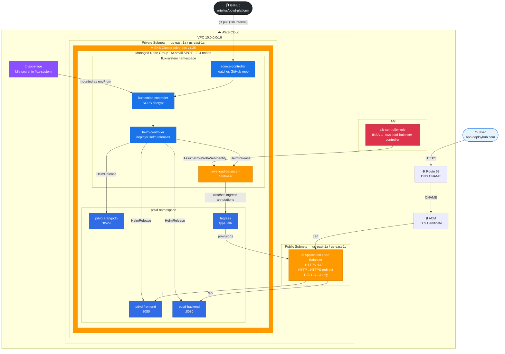

# pdvd-platform

GitOps platform repository for the pdvd application stack. Terraform provisions the infrastructure and bootstraps FluxCD, which then manages all application deployments via Helm.

---

## Directory Structure

```
pdvd-platform/
├── deploy.sh                        # Single entrypoint to deploy GKE or EKS
├── make-secrets.sh                  # Run once before deploy — creates secrets.enc.yaml
│
├── terraform/
│   ├── gke/
│   │   ├── main.tf                  # VPC, GKE cluster, static IP, Flux bootstrap
│   │   ├── sops.tf                  # age keypair generation, sops-age k8s secret
│   │   └── terraform.tfvars         # ← GKE cluster configuration (edit this)
│   └── eks/
│       ├── main.tf                  # VPC, EKS cluster, ALB IAM, ACM cert, Flux bootstrap
│       ├── sops.tf                  # age keypair generation, sops-age k8s secret
│       ├── terraform.tfvars         # ← EKS cluster configuration (edit this)
│       └── alb-controller-iam-policy.json  # Auto-downloaded by deploy.sh
│
└── clusters/
    ├── .sops.yaml                   # ← age public key routing (auto-written by Terraform)
    ├── gke/
    │   ├── flux-system/
    │   │   ├── gotk-components.yaml # Auto-generated by Flux — do not edit
    │   │   ├── gotk-sync.yaml       # Auto-generated by Flux — do not edit
    │   │   └── kustomization.yaml   # ← Add kustomize-controller SA annotation after apply
    │   └── pdvd/
    │       ├── values.yaml          # Plain Helm values (non-secret)
    │       ├── secrets.enc.yaml     # ← SOPS+age encrypted secrets (created by make-secrets.sh)
    │       └── kustomization.yaml   # Flux Kustomization for pdvd HelmRelease
    └── eks/
        ├── flux-system/
        │   ├── gotk-components.yaml # Auto-generated by Flux — do not edit
        │   ├── gotk-sync.yaml       # Auto-generated by Flux — do not edit
        │   └── kustomization.yaml   # ← Add kustomize-controller SA annotation after apply
        └── pdvd/
            ├── values.yaml          # ← Auto-written by Terraform with cert ARN + subnets
            ├── secrets.enc.yaml     # ← SOPS+age encrypted secrets (created by make-secrets.sh)
            └── kustomization.yaml   # Flux Kustomization for pdvd HelmRelease
```

---

## Files You Must Update

### 1. `terraform/eks/terraform.tfvars`

```hcl
aws_region   = "us-east-1"          # AWS region to deploy into
cluster_name = "pdvd-eks"           # EKS cluster name
vpc_cidr     = "10.0.0.0/16"        # VPC CIDR — change if it conflicts with existing VPCs
domain       = "app.deployhub.com"  # Primary domain for ACM cert + ingress host
github_org   = "ortelius"           # GitHub org that owns pdvd-platform
github_repo  = "pdvd-platform"      # GitHub repo name
```

### 2. `terraform/gke/terraform.tfvars`

```hcl
project_id   = "eighth-physics-169321"  # GCP project ID
region       = "us-central1"            # GCP region
cluster_name = "pdvd-gke"              # GKE cluster name
github_org   = "ortelius"
github_repo  = "pdvd-platform"
```

### 3. `clusters/eks/pdvd/secrets.enc.yaml` and `clusters/gke/pdvd/secrets.enc.yaml`

Run `make-secrets.sh` once **before** your first `terraform apply`. It installs `age` and `sops`, generates the keypair, prompts you for each value, and writes the encrypted file:

```bash
./terraform/make-secrets.sh eks
# or
./terraform/make-secrets.sh gke
```

The script prompts for:

```
  smtp.username                       : you@example.com
  pdvd-arangodb.arangodb_pass         : ••••••
  pdvd-backend.rbac_repo_token        : ghp_...
  pdvd-backend.github.clientSecret    : ...
  smtp.password                       : ••••••
  pdvd-backend.github.privateKey      : (paste PEM, then Ctrl-D)
```

Then commit the output before deploying:

```bash
git add clusters/.sops.yaml clusters/eks/pdvd/secrets.enc.yaml
git commit -m "chore: add encrypted secrets"
git push origin main
```

The age private key is saved to `~/.ssh/<cluster-name>.sops.key` — **back this up**. Losing it means losing access to all encrypted secrets.

### 4. `clusters/.sops.yaml`

This file is written automatically by `make-secrets.sh` and updated by Terraform after apply. No manual edits needed. It will look like:

```yaml
creation_rules:
  - path_regex: clusters/eks/.*\.yaml$
    age: age1ql3z7hjy54pw3hyww5ayyfg7zqgvc7w3j2elw8zmrj2kg5sfn9aqmcac8p
  - path_regex: clusters/gke/.*\.yaml$
    age: age1ql3z7hjy54pw3hyww5ayyfg7zqgvc7w3j2elw8zmrj2kg5sfn9aqmcac8p
```

### 5. `clusters/eks/flux-system/kustomization.yaml` and `clusters/gke/flux-system/kustomization.yaml`

Written automatically by Terraform after Flux bootstrap. It patches `kustomize-controller` to mount the `sops-age` Kubernetes secret so it can decrypt secrets at runtime — no IAM annotations or cloud roles needed:

```yaml
patches:
  - patch: |
      apiVersion: apps/v1
      kind: Deployment
      metadata:
        name: kustomize-controller
        namespace: flux-system
      spec:
        template:
          spec:
            containers:
              - name: manager
                envFrom:
                  - secretRef:
                      name: sops-age
    target:
      kind: Deployment
      name: kustomize-controller
```

---

## Environment Variables Required at Deploy Time

```bash
# Required for both GKE and EKS
export TF_VAR_github_token="ghp_..."   # GitHub PAT with repo + admin:public_key scopes

# Required for GKE
gcloud auth application-default login

# Required for EKS
aws configure   # or set AWS_ACCESS_KEY_ID, AWS_SECRET_ACCESS_KEY, AWS_DEFAULT_REGION
```

---

## What Happens When `./deploy.sh eks apply` Runs

`deploy.sh` is a thin wrapper around `terraform init` + `terraform apply`. Here is the full sequence of what Terraform provisions and executes, in order:

### Phase 1 — Infrastructure check
Terraform runs `aws eks describe-cluster` via an external data source to check whether the cluster already exists. If it does, VPC and EKS creation are skipped and existing resources are read instead.

### Phase 2 — Network (if cluster does not exist)
- VPC created with CIDR `10.0.0.0/16`
- Two public subnets (`10.0.1.0/24`, `10.0.2.0/24`) across `us-east-1a` and `us-east-1c`
- Two private subnets (`10.0.10.0/24`, `10.0.12.0/24`)
- Internet gateway, NAT gateway, and route tables
- Subnets tagged with `kubernetes.io/role/elb` and `kubernetes.io/role/internal-elb` so the ALB controller can discover them

### Phase 3 — EKS cluster (if cluster does not exist)
- EKS control plane v1.35 created
- Managed node group: `t3.small` SPOT instances, 2–4 nodes across private subnets
- OIDC provider resolved (used by ALB controller IRSA role)

### Phase 4 — IAM
- ALB controller IAM policy created from the official `iam_policy.json`
- ALB controller IRSA role created with trust policy scoped to `kube-system:aws-load-balancer-controller`
- OIDC provider resolved (enables IRSA for ALB controller only)

### Phase 5 — ACM certificate
- Certificate requested for `app.deployhub.com` with DNS validation
- **Note:** you must add the CNAME validation record to your DNS provider before the certificate reaches `ISSUED` status

> **Note:** Phases 1–5 are pure Terraform using the AWS SDK via your ambient credentials (`~/.aws/` or `AWS_*` env vars) — the `aws` CLI is not required during this stage. Phases 6 onwards are a `null_resource` bootstrap script that runs after all infrastructure is provisioned.

### Phase 6 — Git sync
- A `null_resource` runs `git pull --rebase origin main` before any files are written
- This ensures the local repo is fully up to date before `values.yaml` is modified, preventing push conflicts later

### Phase 7 — values.yaml generation
- `clusters/eks/pdvd/values.yaml` is written with the real `certificateArn` and `subnets` values resolved from Terraform outputs
- Written after the git pull so there is no risk of overwriting remote changes

### Phase 13 — Bootstrap script starts: tool installation
The `null_resource` bootstrap script is the first thing to execute after Terraform completes. It immediately checks for and installs missing tools:
- `aws` CLI
- `kubectl`
- `flux` CLI
- `helm`

Each is downloaded as a zip/tar.gz from the official source, detected for the correct OS and architecture (`linux/amd64`, `linux/arm64`, `darwin/amd64`, `darwin/arm64`).

### Phase 13 — Git commit
- `clusters/eks/pdvd/values.yaml` is staged and committed with message `chore(eks): update pdvd values with infrastructure outputs`
- Pushed to `origin main` so Flux can read it on first sync

### Phase 13 — kubeconfig
`aws eks update-kubeconfig` writes cluster credentials to `~/.kube/config`.

### Phase 13 — Node readiness
The script loops up to 30 times (10s sleep between attempts), re-fetching the kubeconfig token each iteration, until all nodes report `Ready`.

### Phase 13 — Flux bootstrap
`flux bootstrap github` is executed:
- Generates an ECDSA SSH key pair
- Registers the public key as a deploy key on `ortelius/pdvd-platform`
- Installs Flux controllers into `clusters/eks/flux-system/`
- Commits `gotk-components.yaml` to the repo
- Flux begins watching `clusters/eks/` for Kustomization objects

### Phase 13 — age keypair + sops-age secret
- `age-keygen` generates a keypair to `~/.ssh/pdvd-eks.sops.key` (skipped if already exists)
- The private key is loaded into a Kubernetes secret `sops-age` in `flux-system`

### Phase 14 — `.sops.yaml` committed
- `clusters/.sops.yaml` is written with the age public key and pushed to the repo

### Phase 15 — kustomize-controller patched
- `clusters/eks/flux-system/kustomization.yaml` is written and pushed, patching `kustomize-controller` to mount `sops-age` via `envFrom`

### Phase 16 — Flux reconciliation
Once Flux picks up the kustomize-controller patch it restarts with SOPS decryption enabled and reconciles:
1. The `pdvd` HelmRelease using values from `values.yaml` + decrypted `secrets.enc.yaml`
2. The `aws-load-balancer-controller` HelmRelease
3. On seeing the `Ingress` object with ALB annotations, the ALB controller provisions the Application Load Balancer

### After deploy — DNS
```bash
# Get the ALB hostname
kubectl get ingress -n pdvd pdvd-frontend-ingress \
  -o jsonpath='{.status.loadBalancer.ingress[0].hostname}'

# Create a CNAME record in your DNS provider:
# app.deployhub.com → <alb-hostname>.us-east-1.elb.amazonaws.com
```

---

## Architecture Diagram



---

## Verifying the Deployment

After `./deploy.sh eks apply` completes, verify everything is running:

```bash
# Check all Flux controllers are ready
kubectl get pods -n flux-system

# Expected output:
# helm-controller-xxx             1/1  Running
# kustomize-controller-xxx        1/1  Running
# notification-controller-xxx     1/1  Running
# source-controller-xxx           1/1  Running

# Check pdvd application pods are running
kubectl get pods -n pdvd

# Expected output:
# pdvd-frontend-xxx               1/1  Running
# pdvd-backend-xxx                1/1  Running
# pdvd-arangodb-xxx               1/1  Running

# Check ALB controller is running
kubectl get pods -n kube-system -l app.kubernetes.io/name=aws-load-balancer-controller

# Check Flux HelmReleases are reconciled
kubectl get helmrelease -n pdvd

# Expected output:
# pdvd-frontend    True    Release reconciliation succeeded
# pdvd-backend     True    Release reconciliation succeeded
# pdvd-arangodb    True    Release reconciliation succeeded

# Check the Ingress has an ALB hostname assigned
kubectl get ingress -n pdvd

# Expected output:
# pdvd-frontend-ingress  <none>  app.deployhub.com  k8s-xxx.us-east-1.elb.amazonaws.com  80,443
```

## Accessing the App

`deploy.sh` polls for the ALB hostname after apply and prints the DNS record to create. Once the ALB is ready you will see:

```
╔══════════════════════════════════════════════════════════════╗
║  DNS Setup                                                   ║
╠══════════════════════════════════════════════════════════════╣
║  Create a CNAME record in your DNS provider:                 ║
║                                                              ║
║  Name : app.deployhub.com                                    ║
║  Type : CNAME                                                ║
║  Value: k8s-pdvd-xxx.us-east-1.elb.amazonaws.com            ║
╠══════════════════════════════════════════════════════════════╣
║  Once DNS propagates, open:                                  ║
║    https://app.deployhub.com                                 ║
╚══════════════════════════════════════════════════════════════╝
```

Add the CNAME in your DNS provider (Route 53, Cloudflare, Namecheap, GoDaddy, etc.) pointing your domain at the ALB hostname. DNS propagation typically takes 1–5 minutes.

You also need a CNAME for ACM certificate validation (only required once — check `aws acm describe-certificate` for the validation record):

```bash
aws acm describe-certificate   --certificate-arn $(terraform -chdir=terraform/eks output -raw acm_certificate_arn)   --query 'Certificate.DomainValidationOptions[0].ResourceRecord'
```

To test before DNS propagates:

```bash
ALB=$(kubectl get ingress -n pdvd pdvd-frontend-ingress   -o jsonpath='{.status.loadBalancer.ingress[0].hostname}')
curl -sk -H "Host: app.deployhub.com" https://$ALB
```

Once DNS propagates, open:

```
https://app.deployhub.com
```